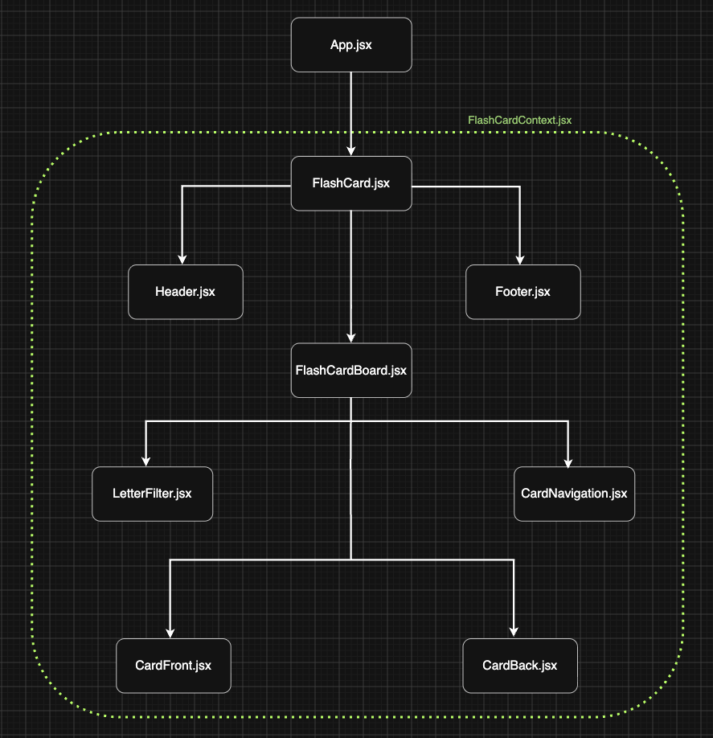

### Hangul Flashcard App

- A simple React flashcard app for learning the Korean Hangul alphabet

## Motivation

- currently learning Korean as a hobby
- Duolingo skips the alphabet and goes straight into words/phrases, this app can bridge that gap for beginners
- build a React project to practice components,props,state

## Features

- flashcards for Hangul alphabet, flip to reveal pronunciation
- filter by consonants/vowels
- card navigation (next/previous)
- shuffle deck
- audio pronunciation

## Tech Stack

- React (components,state)
- CSS

# Project Status

- may expand to support additional study modes/features e.g. constructing words

# Component Tree

Notes
6/9/26

- discovered that the fetched alphabet data was not actually rendered in FlashCard.jsx, I had received the fetched data and simply printed it to the console. The displayed alphabet data was still using the imported local variable "alphabet", introduced new state variable alphabetData to store fetch data, initialised to []
- added a new useEffect to update 'deck' and 'length' when alphabetData receives fetch data
- this introduced another bug in CardFront.jsx and CardBack.jsx with received 'card' as a prop. card --> currCard --> deck --> sortedDeck (initialised as [], updated by alphabetData)

- in CardFront.jsx, added another &&condition --> &&card &&(...) , render only when card has received data. Destructured prop in the jsx e.g. {card.type} instead of top level destructuring e.g. const {char,type}=card

- in CardBack.jsx, added a guard clause before destructuring 'card'.
